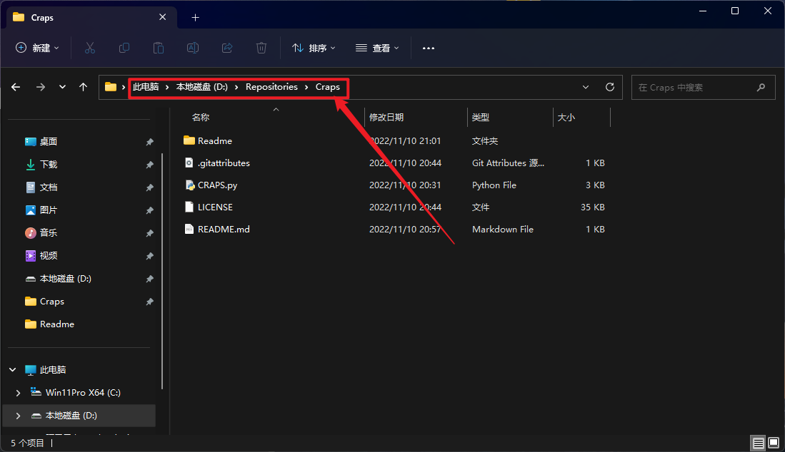
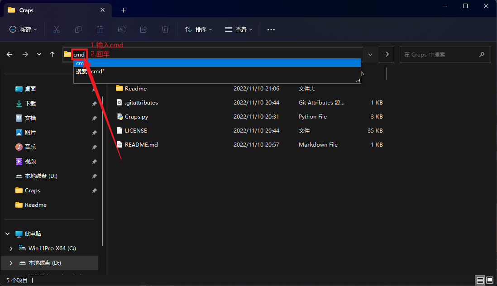

# Craps
 Craps赌博游戏(基于Python)

如何打包?

1.安装pyinstaller库(代码如下)

```bash
pip install pyinstaller
```

2.使用Windows资源管理器打开到项目位置

比如"D:\Repositories\Craps"



3.在搜索框内输入cmd并回车



4.输入如下命令开始编译

```bash
pyinstaller -F craps.py
```


5.打开目录下的dist文件夹


6.打开craps.exe


7.程序开始运行


